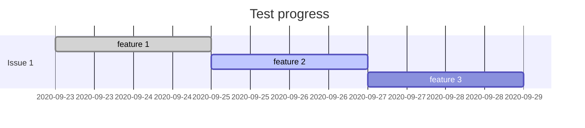

# ANZ joint lab test

## Personal information

| Name   | Student ID    |
| ------ | ------------- |
| 贾怀宇 | 2020090916007 |

## Test progress

> *Show your progress below.*

> *Or write it directly:*
> ***FINISHED:***
> ...
> ...

---
## Answer sheet

> *Write your answer below. (if asked)*

1.git版本管理理解：远程仓库的创建对储存代码有明显的正面作用，人们的存储代码的方式也得到质的提升

2：git的分支很方便，先分清楚四种分支类型，理解起作用，并结合项目与代码的相关方面，进行管理。

可以添加这个团队为合作者，在进行远程提交。

3查看提交历史，然后使用指令git reset --hard 回到那个版本 再使用指令git push  强制提交，此时之前自己的提交误操作将从远程仓库撤销。

4：建立两个仓库AB，若AB有文件的同一行，在A修改后提交，B可能会发生代码错误，导致远端无法提交。

解决：下载所有分支的最新代码，打开冲突的文件，留下保存的内容，其他的删了。

5：

 